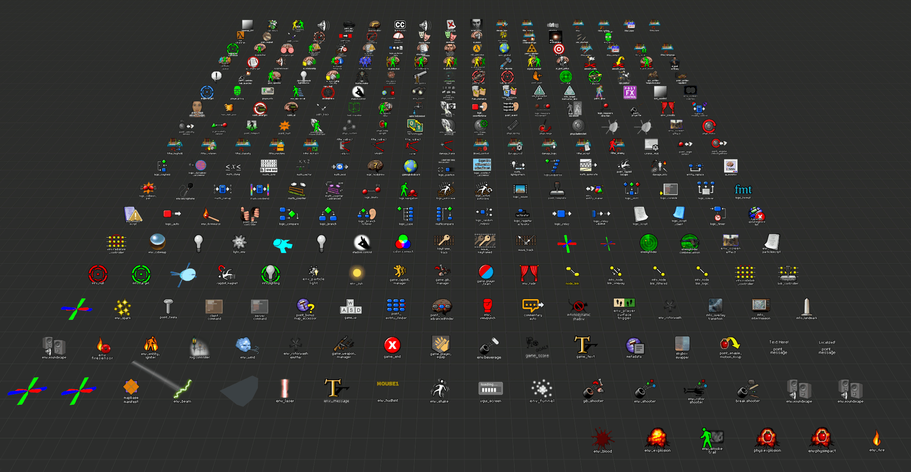

# Vizzy's enhanced Mapbase and Entropy Zero 2 .fgd's!  

**Mapbase install instructions:** Click download .zip, extract, copy & overwrite shared_misc folder at:
`steamapps\sourcemods\mapbase_shared\shared_misc`
then add half-life2.fgd to hammmer config.

**Entropy Zero 2 install instructions:** Click download .zip, extract, copy & overwrite entropyzero2 folder at:
`steamapps\common\EntropyZero2\entropyzero2`
then add EntropyZero2.fgd to hammmer config.

.psd files are for Adobe Photoshop
----

| --CREDITS-- |  | Website |
|:----|------|:-------|
| Ficool2 | To my knowledge all icons in editor-ficool were created by them (or A Boojum Snark). I painstakingly copy/pasted each icon from their tf2 ultimate .FGD (from tf2maps.net) over to the Mapbase .FGD. I edited and reused a few of their icons as well.| https://ficool2.github.io/HammerPlusPlus-Website/ |
| Blixibon | I edited and reused a few of their Mapbase specific icons such as logic_script and damage_info for example. | https://github.com/mapbase-source/source-sdk-2013 |
| Ellent | I combined my modified entropy zero 2 .FGD's with theirs for twice the improvements. | https://steamcommunity.com/id/koishis_mr_hat |
| TeamSpen210 | Some icon entity's like point_entity_finder are by them (i asked nicely), and I based some like point_advanced_finder off of them as well. Took inspiration & some fixes from their fgd.| https://github.com/TeamSpen210 |
| A Boojum Snark | Inspiration for ficool's FGD which in turn inspired mine. It's all your fault 😂 | https://tf2maps.net/downloads/ultimate-mapping-resource-pack.510/ |
| The Spud Lord | When Ficools FGD disappeared, he stepped up. I Took inspiration & some fixes from their fgd. | https://tf2maps.net/threads/an-fgd-fit-for-a-lord.41812/ |
| Brokkhouse | And when spud lord left, Brokkhouse rose to take the team fortress 2 .fgd throne. A valuable reference point using their inherited .FGD knowledge. | https://tf2maps.net/downloads/an-fgd-fit-for-a-lord-brokk-edition.15924/ |
| MrFunReal | Some sort of gooner that also makes .FGD's. Very cool and relatable. Some clever ideas taken from their L4D2 .FGD's | https://steamcommunity.com/id/funreal (nsfw) |
| Pinsplash | The obscure source engine knowledge king. You bow to no one. I Used many of their descriptions and found many hidden gems of knowledge long forgotten. | https://github.com/Pinsplash/SEFGD |
| Cvoxalury | Added some stuff unnoticed by perusing their Dark Interval fgd's. | https://www.moddb.com/mods/dark-interval/downloads/dark-interval-part-2-source-files |
| Vizzys | Thas me. I wrote this. I made the bad icons. I'm thanking myself. I also hate myself. | https://developer.valvesoftware.com/wiki/User:Vizzys |
----
**Valve Developer Community:** 
https://developer.valvesoftware.com/
They get a mention too.

